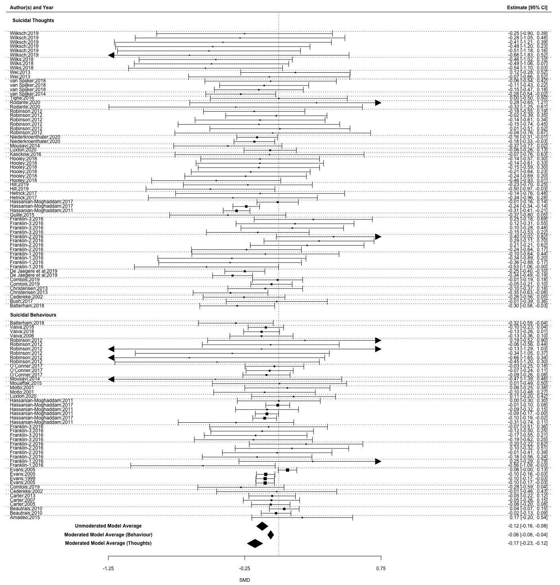

```{r setup, include=FALSE}
knitr::opts_chunk$set(echo = TRUE)
op0 = function(x, d=0) sprintf(paste0("%1.",d,"f"), x) 
op = function(x, d=2) sprintf(paste0("%1.",d,"f"), x) 
```

# Introduction

Suicidal thoughts and behaviours are both a challenge for public health and for service providers, given that annually 138 Million people experience suicide ideation, 20.7 Million people attempt suicide [@borges2010] and around 700.000 people die by suicide [@worldhealthorganization2021]. Still only 17% to 56% of them receive treatment [@bruffaerts2011]. Besides these undressed needs, low treatment rates are linked to two structural barriers: Treatment cost and availability [@bruffaerts2011].

Improving affordability and accessibility of treatment means to provide suicide specific care in terms of tailored interventions according to the patients stage of suicidal progression, rather than using a one fits all solution. It has been suggested to implement a stepped care approach, least restrictive care at early stages and to increase restrictions gradually with advancement of suicidal progression [@jobes2018]. In this sense, easily available and affordable treatment can lower treatment barriers and involve individuals otherwise hesitating to seek help at early suicidal stages [@bruffaerts2011]. Early interventions at the stage of suicide ideation, have been suggested to lower human suffering and to prevent future suicides [@zuromski2019].

Distance Based Interventions (DBI) are least restrictive treatments, in terms of local availability, affordability and service opening hours. Under-serviced areas can be supported by both tele-health and Apps. And while in the short term the development and evaluation of Apps and tele-health interventions are expensive, these are less expensive than individual psychotherapy, when a large amount of people are treated.

During the past two decades a number of randomized control trials examining DBI have been published. Starting at the turn of the millennium, with studies using phone-calls [@evans1999] and post-cards [@motto2001], leading to crisis hotlines and e-mail follow-ups [@luxton2020]. Recently the field has expanded to online programs [@vanspijker2014; @franklin2016] and since the Covid-19 outbreak increasingly to tele-health approaches [@fernandez2021]. Several Meta-analyses have been published on subsets of DBI [@milner2015; @torok2020].

To give recommendations for future research, our meta-analysis differentiated between autonomous DBI (aDBI) (i.e. apps, online programs) and human DBI (hDBI) (phone calls, postcards, tele-health), which allows to investigate, whether the scalability of hDBI can be utilized without risking effectiveness. To reach as many suicidal individuals as possible in early stages of progression, distance based programs need to be scalable and cost-effective. aDBI have superior scalability compared to hDBI [@batterham2015], as they are less expensive per intervention, less restricted by service opening hours, they are translatable, and immediately available.

In order to draw practical conclusions we asked three questions, implemented as moderation analyses: (a) Whether DBI are effective against suicide ideation and/or against suicidal behaviours, (b) How stable these interventions are over time and (c) Whether effectiveness of such programs was independent from the chosen control groups (TAU/Attention Placebo/waitlist).

## Methods

The systematic search followed the Preferred Reporting Items for Systematic Reviews and Meta-Analyses guidelines [@page2021] and was Pre-Registered on Prospero under the pre-registration number: CRD42020218791.

## Systematic Search

Search strings were defined using repeated searches combining MeSH terms relating to suicide prevention OR intervention, with the intervention types, (e.g.) Letter, App, Web-based, OR distance. The resulting search string was tested and refined using two related meta-analyses, one on hDBI [@milner2015] and one aDBI [@torok2020] (see Appendix for final strings).

Once search strings were established, the first one hundred search results of Web of Science were examined together by the authors J.S. and K.R., establishing a common degree of understanding. After which, both authors independently searched Web of Science, Scopus and Pubmed; Systematic searches were last updated in December 2021 . Cohen's kappa between both authors was 0.806.

## Inclusion and exclusion criteria

All peer reviewed randomized control trial studies were included, which investigated any form of Distance Based Interventions (DBI) with at least one primary outcome being self-harming thoughts and/or behaviours, such as suicidal ideation, suicidal planning, suicide attempts, and suicide. Face-to-face meetings were allowed, if these were not part of the intervention - i.e. for informing, testing or screening purposes.

All self harming thoughts and behaviour outcomes of applicable studies were coded, excluding combined outcome measures, such as the total score of SBQ-R, summing thoughts and behaviours in a total score.

## Data Extraction and Coding

Data was coded independently by two authors (J.S and K.R.). Where possible non-imputed results, were coded. The following variables were extracted: Author, Year, control group of study, Country of Study, Sample type, sample size, intervention type, sex ratio, mean age, mean age(SD), the outcome name (e.g. self-harm), intervention duration in weeks, the participant attrition rate, the follow up time, standard mean difference (*SMD)* and variance of *SMD*. In addition, all outcomes were coded for the moderation analysis into subgroups (see Table 1).

| Moderator group   | **Outcome Name**                                                                                             |
|-------------------|--------------------------------------------------------------------------------------------------------------|
| Acts              | Suicide, suicide attempts, self harming behaviours.                                                          |
| Thoughts          | Suicidal thoughts, suicidal ideation, suicide plans.                                                         |
| Human involved    | Phone calls, cognitive behavioural treatment, personalized letters or personalized e-mails.                  |
| Autonomous        | Applications, websites, non-individualized letters or non-individualized e-mails.                            |
| TAU               | TAU, enhanced TAU, intensive case monitoring,                                                                |
| Attention Placebo | Attention placebo, control article, journalling, attention control, control program, body positivity images. |
| waitlist          | no contact, reminder letter at the end, waitlist, no interventions                                           |

: Outcome allocation to Moderator Analyses

The authors compared finalized coding sheets, discussed differences and re-coded affected studies until a unanimous result was achieved.

## Risk of bias and publication bias

Risk of bias was assessed using the RoB-2 [@sterne2019] and Trim and Fill was used as the publication bias detection [@fernandez-castilla2021; @renkewitz2019].

## Statistical Method

To incorporate all outcomes of interest we used a three level meta-analysis [@vandennoortgate2015; @cheung2019], with Robust variance estimation (RVE) [@hedges2010; @moeyaert2017]. RVE return valid confidence intervals in presence of dependent data [@park2019]. While the three level model allowed for outcome-level heterogeneity investigation [@vandennoortgate2013], RVE return valid confidence intervals in presence of dependent data [@park2019]. Models were fitted with restricted maximum likelihood estimation (REML), RVE correction was based on @pustejovsky2016.

Calculations were done in R [@rcoreteam2020] using the package metafor for the three level model [@viechtbauer2010c] and the package clubSandwich [@pustejovsky2021a] for the RVE correction. All Data needed for full reproducibility are publicly available on Github.[^1]

[^1]: Link: [\<https://github.com/jim-schmeckenbecher/Distance-based-Interventions\>](https://github.com/jim-schmeckenbecher/Distance-based-Interventions){.uri}.

## Sensitivity Analysis

Given that NSSI [@americanpsychiatricassociation2013a] and suicidal behaviours [@joiner2005] differ qualitatively, we employed two sensitivity analyses: (a) Including Non-Suicidal Self-Injury (NSSI) as an outcome, (b) Excluding suicide cases as an outcome.

## Deviation from Pre-Registered Report

Given most recent developments in meta-analytical research we adapted the procedure as follows: Firstly, instead of a more complex multi-level model, we employed a hybrid model of RVE correction and multilevel methodology [@pustejovsky2021], thereby improving efficiency and reducing risk of bias. Secondly, we followed the publication bias detection method recommended by @fernandez-castilla2021 instead of that by @renkewitz2019 although for this data set, both recommend the same method.

# Results

```{r include = FALSE}
source("04_Code.R", local = knitr::knit_global())

```

## Emerged Data

We identified 2,213 papers in the databases (see Flow Chart), in the end `r max(Total$Study_ID)` independent studies were included in the analysis. The difference between included studies in the Flow chart and reported independent studies is explained by follow-up studies that use the same sample as their parent study. These follow-up studies are reported as studies, but because they are statistically dependent to their parent, they were treated as dependent within our meta-analysis. Further one study included 3 statistically independent RCT trials [@franklin2016].


Overall, `r sum(Total$count)` outcomes emerged, with `r sum(Total$Thinking)` outcomes of the category thinking, predominantly ideation and planning, and `r sum(Total$count) - sum(Total$Thinking)` outcomes of the category acting, including studies examining mostly deliberate self-harm, self-harm and suicide attempts.

`r sum(Total$count) - sum(Total$Autonomous)` outcomes were found in the hDBI category and `r sum(Total$Autonomous)` outcomes were found for aDBI. The median duration of studies was `r op(median(Study_avarage$Duration_weeks))` weeks, with a range of `r min(Total$Duration_weeks)` to `r max(Total$Duration_weeks)` weeks. The median time between post-intervention measures and follow up measures was `r median(median(Study_avarage$Follow_up_Time, na.rm=TRUE))` weeks, with a range of `r max(Total$Follow_up_Time,  na.rm = TRUE)` weeks to `r min(Total$Follow_up_Time,  na.rm = TRUE)` weeks. Finally `r op0(sum(Total$TAU))` outcomes were based on TAU group comparisons, `r op0(sum(Total$wait))` outcomes were based on waitlist control groups and `r op0(sum(Total$Attention))` outcomes were based on attention Placebo control groups.

The median attrition rate was `r op(median(Study_avarage$Total_Attrition, na.rm=TRUE))` % with a maximum of `r max(Study_avarage$Total_Attrition, na.rm=TRUE)` % and a minimum of 0 %.

### Sample Characteristics

In total `r sum(Study_avaragePost$n)` participants were included at post-intervention and *n=* `r sum(Study_avarageFollow_up$n)` at follow up. Out of all, `r op(mean(Study_avarage$Sex_Female))` % female and on average `r op(mean(Study_avarage$Age_.mean.,na.rm=TRUE))` (SD= `r op(mean(Study_avarage$Age_.SD., na.rm=TRUE))`) years old. In studies the youngest reported mean sample age was `r op(min(Study_avarage$Age_.mean.,na.rm=TRUE))` (SD= 1.4) years, the oldest mean sample age was `r op(max(Study_avarage$Age_.mean.,na.rm=TRUE))` (SD= 11.3)years.

Out of a total of n= `r max(Total$Study_ID)` studies, most data was retrieved from westernised educated industrialised democracies (WEIRD), predominantly the United States (*k=* 10), followed by Australia (*k* = 9). From non-westernised educated industrialised democracies *k = 5* studies emerged.

## Main Analysis

Distance Based Interventions (DBI were effective against suicidal thoughts and behaviours, standardized mean difference (SMD) = `r op(OverallRVECI$beta)` CI95%[`r op(OverallRVECI$CI_L)`; `r op(OverallRVECI$CI_U)`]; Heterogeneity was significant at *Q* (df = `r Overall$ddf[[1]]`)= `r op(Overall$QE)`, *p =* `r op(Overall$QEp)`.

DBI are more effective against suicidal thoughts than suicidal behaviours (*SMD=* `r op(Overall.TRVECI$beta[2])` CI95%[`r op(Overall.TRVECI$CI_L[2])`; `r op(Overall.TRVECI$CI_U[2])`]). The average effectiveness against suicidal thoughts was *SMD=* `r op(Overall.T2RVECI$beta[1])` CI95%[`r op(Overall.T2RVECI$CI_L[1])`; `r op(Overall.T2RVECI$CI_U[1])`], while suicidal behaviours was lower at around *SMD=* `r op(Overall.TRVECI$beta[1])` CI95%[`r op(Overall.TRVECI$CI_L[1])`; `r op(Overall.TRVECI$CI_U[1])`]. Heterogeneity was non-significant *Q* (df = `r Overall.T$ddf[[1]]`) = `r op(Overall.T$QE)`, *p =* `r op(Overall.T$QEp)`. (See Figure 2)

{width="1586"}

Due to the small number of studies using waitlist, the comparison of waitlist and attention placebo groups were not trustworthy according to their profile likelihood plots [@raue2009].

Therefore, waitlist and attention placebo were combined into one control group, and compared to TAU.

Comparing the combined control-group vs. TAU, retuned that DBI given alongside TAU was significantly less effective against suicidal thoughts or behaviours (*SMD=* `r op(Overall.CRVECI$beta[1])` CI95%[`r op(Overall.CRVECI$CI_L[1])`; `r op(Overall.CRVECI$CI_U[1])`]), than DBI given alongside a waitlist or attention placebo control group. Heterogeneity remained significant at *Q* (df = `r OverallC$ddf[[1]]`) = `r op(OverallC$QE)`, *p =* `r op(OverallC$QEp)`.

Possible covariance of control-group type (i.e. TAU vs. Watilist and attention placebo) and outcome type (i.e. Thinking vs. Acting) was investigated. As suicidal behaviours and suicidal thoughts were unevenly distributed between studies using different control-group types (see figure 2). An exploratory analysis including both moderators was implemented. When including both moderators, the difference between control groups became non-significant, with *SMD=* `r op(Overall.TTRVECITT$beta[3])` CI95%[`r op(Overall.TTRVECITT$CI_L[3])`; `r op(Overall.TTRVECITT$CI_U[3])`], but suicidal acts and suicidal thoughts remained a just significant moderator, with *SMD =* `r op(Overall.TTRVECITT$beta[2])` CI95%[`r op(Overall.TTRVECITT$CI_L[2])`; `r op(Overall.TTRVECITT$CI_U[2])`] in favour of suicidal thoughts; heterogeneity was not significant at *Q* (df = `r Overall.TT$ddf[[1]]`) = `r op(Overall.TT$QE)`, *p =* `r op(Overall.TT$QEp)`.


Effectiveness of Distance Based Interventions decreased between time-points at *SMD =* `r op(Overall.FCRVECI$beta[2])` CI95%[`r op(Overall.FCRVECI$CI_L[2])`; `r op(Overall.FCRVECI$CI_U[2])`] non-significantly. Heterogeneity was significant at *Q* (df = `r OverallF$ddf[[1]]`) = `r op(OverallF$QE)`, *p =* `r op(OverallF$QEp)`.

hDBI were with *SMD=* `r op(Overall.IRVECI$beta[2])` CI95%[`r op(Overall.IRVECI$CI_L[2])`; `r op(Overall.IRVECI$CI_U[2])`] insignificantly less effective than aDBI, heterogeneity was significant at *Q* (df = `r Overall.I$ddf[[1]]`) = `r op(Overall.I$QE)`, *p =* `r op(Overall.I$QEp)`.

## Sensitivity Analysis

Both, inclusion of NSSI outcomes (*o* = `r sum(Total2$NSSI)`) and exclusion of suicide outcomes (*o* = `r sum(Total$Suicide)`) had negligible impacts on the subgroup of behaviour outcomes. Inclusion of NSSI increased the effectiveness to SMD= `r Overall.TRVE2$beta[1]` from SMD= `r Overall.TRVE$beta[1]`. and exclusion of suicide studies decreased effectiveness from SMD = `r Overall.TRVE$beta[1]` to SMD= `r Overall.TSRVE$beta[1]`. Note only @franklin2016 reported NSSI measures.

## Publication Bias and Risk of Bias Assessment

Risk of bias of all *independent* studies was mixed (see Figure 3.). Using Trim and Fill, no publication bias could be observed.

{width="21cm"}

# Discussion

In this meta-analysis, we examined the effectiveness of Distance Based Interventions (DBI) in reducing suicidal ideation and behaviour. The quality of evidence was good, with a substantial number of high and medium quality studies and no observed publication bias. On average, DBI reduced both suicidal ideation and suicidal behaviour.

### Contextualising results with other Meta-Analyses

We contextualise our findings using meta-analyses of psychotherapeutic face-to-face interventions for suicidal ideation and/or behaviour. While it can be argued that such a comparison is biased, as each meta-analysis has different inclusion criteria, designs and underlying assumptions, it nevertheless offers a rough contextualisation, which is important to gasp what effect sizes are common for suicide prevention interventions. To maximise comparability we only include meta-analyses of RCT studies, which used TAU, Wairlist or Attention-Placebo control groups from the last ten years.

We searched Web of Science using the search term: '"suic\*" AND "therap\*" AND (meta-analys\* OR meta analys\*)'. Nine meta-analyses were found [@chen2021; @bahji2021a; @kothgassner2020a; @yuan2019; @briggs2019; @hetrick2016; @hawton2016; @ougrin2015; @panos2014]. One [@hetrick2016] did not exclude particular populations or therapeutic approaches.

#### Effectiveness of Distance Based Interventions (DBI) for suicidal behaviours

We showed that DBI significantly reduced suicidal behaviours(*SMD*= `r op(Overall.TRVECI$beta[1])` CI95%[`r op(Overall.TRVECI$CI_L[1])`; `r op(Overall.TRVECI$CI_U[1])`]). When comparing the results of our meta-analysis on DBI with the results of nine meta-analyses on face-to-face interventions, we found three meta-analyses with some significantly stronger results, while six meta-analyses reported non-significantly different results.

Two of the three meta-analyses had adolescent samples [@kothgassner2020a; @bahji2021a] and showed significantly greater reductions of self-injury by Dialectical Behavioural Therapy (DBT) at post-treatment [@kothgassner2020a; @bahji2021a], than what we found for DBI; at three-month follow-up these were no longer significantly more effective [@bahji2021a]. In addition, one meta-analysis reported significantly stronger results by eclectic therapy (ET) [@bahji2021a], than what we found for DBI; but ET led to a significant increase in self-harm at three months follow-up.

The third meta-analysis that reported stronger results, than what we found for DBI included only psychoanalytic approaches [@briggs2019]. Psychoanalytic approaches reduced self-harm significantly more than our results for DBI at 6 months, but no longer at 12 months. All three meta-analyses predominantly used TAU as control groups.

This comparison shows that some face-to-face interventions are most likely more effective than DBI, while others are not and few are even harmful [@briggs2019]. Further this comparison shows that research is still to underpowered for therapeutic approaches to be distinguished with statistical certainty.

In turn, confidence intervals are important in suicide research, as they can tell us the clinical potential of an intervention. For example, the effect size of @briggs2019 against suicide attempt episodes at 12 months follow-up is -reported as Number Needed to Treat- (NNT)- = 7.4 CI95% [Inf; 3.6]. This means that while this intervention could be ineffective (infinitely many patients need treatment), it can potentially help one in four patients, even after 12 months. In contrast DBI, reported as NNT = 29.5 CI95% [59; 22.1], means that suicidal behaviours will be reduced with a 95% certainty, but at best one in twenty-two patients can be helped.

Therefore, DBIs, with their small, but consistent reduction in suicidal behaviour are useful. Both for those who are unable to receive face-to-face treatment and for those who are unwilling to seek face-to-face treatment. However, more effective methods such as DBT or psychoanalysis should be offered to those willing to engage in treatments.

### Effectiveness of Distance Based Interventions for suicidal thoughts

Suicidal thoughts are reduced by Distance Based Interventions (`r op(Overall.T2RVECI$beta[1])` CI95%[`r op(Overall.T2RVECI$CI_L[1])`; `r op(Overall.T2RVECI$CI_U[1])`]). However, face-to-face interventions are more effective against suicidal ideation [@hetrick2016], than the results we found for DBI. And while most meta-analyses that differentiate therapeutic approach reported comparable results to those found in our meta-analysis for DBI, this is most likely due to lacking power of these more specific meta-analyses.

But, due to the large number of individuals suffering from suicidal ideation [@borges2010] and the effectiveness of DBI, alongside its superior scalability [@batterham2015], we see a role for DBI in the treatment of suicidal ideation.

### Research recommendations

According to our results, autonomous Distance Based Interventions (aDBI) (SMD= `r op(Overall.I2RVECI$beta[1])` CI95%[`r op(Overall.I2RVECI$CI_L[1])`; `r op(Overall.I2RVECI$CI_U[1])`]), were as effective as human involved interventions (hDBI)(SMD= `r op(Overall.IRVECI$beta[1])` CI95%[`r op(Overall.IRVECI$CI_L[1])`; `r op(Overall.IRVECI$CI_U[1])`]). But aDBI promise better scalability [@batterham2015], making them more feasible for studies with larger sample sizes and replication studies; something that holds true for almost any psychotherapeutic intervention.

Studies with large sample sizes or study sets using close replications are needed, as only these allow us to control for the characteristics of Distance Based Interventions and by such, to understand which components are most effective.

In general, assumptions about distance-based interventions (DBI) for mental health often lack evidence [@musiat2014]; for example, the assumption that 24-hour availability is beneficial. The best meta-analytically supported assumptions we have are for the cost-effectiveness, acceptability and satisfaction of DBI. However, these evidences relate to mental health interventions in general [@eze2020; @musiat2014], not to DBI for suicidal behaviour or thoughts.

In this sense, the development of well powered aDBIs for suicide intervention and their effective components is still is in its infancy and needs to addressed in future more scrupulously.

### Implications for clinical practice

#### Placing Distance Based Interventions on the stepped care model

The stepped care model for suicide care [@jobes2018] includes 5 levels of intervention, ranging from least restrictive Telephone (level 1), Brief interventions (2), outpatient care (3), partial hospitalisation (4) to most restrictive interventions like inpatient care/full hospitalisation (5).

As such, both the least costly and restrictive level of stepped care, 'telephone interventions and follow-ups' and the second least costly and restrictive level, 'Brief interventions and follow-ups' can be supplemented or supplanted by DBI. Further, given that effect-sizes of DBI were in some cases similar to other face-to-face interventions, DBI can be used to supplement all three remaining levels of care.

For the best time to intervene all meta-analyses, including the here presented meta-analysis show that it is more effective to intervene against suicidal thoughts than against suicidal acts. Therefore, there is a strong argument for the implementation of such interventions among individuals with suicide ideation, as recently discussed by @jobes2019. aDBI can be seen as a key element so accomplish early intervention.

The availability of face-to-face interventions in mental health clinics and among individual mental health professionals, such as psychiatrists and psychotherapists is unevenly distributed geographically [@kapusta2010; @pirkola2009] and may be limited in pandemic containment efforts against Covid-19. The resulting unavailability may be compensated for by aDBIs, which are not affected by geographic distribution or lockdowns. In addition the reality of psychiatric treatment includes high costs for individuals or the public health system [@wittchen2011a], depending on whether psychiatric treatment is covered by insurance. This often results in long waiting times for patients in need [@zepf2003]. In both cases, aDBIs can help mitigate the negative effects of barriers to help seeking, by offering an intermediate alternative, thereby bridging waiting times and lower costs. Finally aDBI can help to scale up mental health services especially in low and middle income countries (LMIC), as called by @chisholm2007 and thereby contribute to the Sustainable Mental Health Development Goals, set out be the UN [@patel2018].

## Limitations

Given our comprehensive approach, some limitations should be noted. Firstly, we did not include any grey literature. This can cause selection bias, as the publication bias suppresses non-significant results. However, it is unlikely that RCT studies of multidisciplinary efforts remain unpublished. Further we see risk of non-publication due to reporting non-significant results, as almost all considered studies included non-significant results. This decision reduced work load notably and is in line with previous meta-analyses to this field [@torok2020; @milner2015].

The second potential limitation is that most studies included in this meta-analysis are already covered by previously published meta-analyses [@torok2020; @milner2015]. However, these previously published meta-analyses used the Hedges-Olkin meta-analysis, which allows only the inclusion of independent data, in contrast to multi level meta-analysis, which allows inclusion of all relevant data [@cheung2019].

Utilizing all relevant data has multiple advantages, such as (a) higher precision (b) and less bias risk. (a) Including multiple non independent data points per study increases precision. Further it allows important moderator analyses to be implemented in one model, which allows to weigh evidence according to its information value. In contrast, previous meta-analyses had to use independent subgroup analyses, which have lower precision and only allow unweight indirect comparisons. (b) Bias risk, as stated Hedges-Olkin meta-analytsis [@torok2020; @milner2015] must select one outcome per independent analysis. This can introduce a selection bias, as it works under the assumption that the chosen outcome is representative of all other outcomes. Based on these points and the fact that we updated and broaden the systematic searches of previous meta-analyses, the current meta-analysis substantially adds to the research field.

Despite the above stated advantages a multilevel meta-analytical method introduces two potential limitations. First, the employed method requires more studies to reach adequate power. The number of included studies was relatively low for the complex model, thus potentially leading to underpowered results [@tanner-smith2014]. But results were trustworthy, based on Profile Likelihood Plots ( R package *metafor) [@raue2009]* and adequately powered, accroding to the reported degrees of freedom reported by the RVE Correction (R package *clubsandwich*) [@pustejovsky2016]. Second, RVE corrected models do not report heterogeneity estimations, therefore heterogeneity estimations of the Multi-level model were reported. However *Q-* test results are not biased by dependency and therefore statistically valid, while power of the *Q*-Test was sufficient [@maeda2016].

## Conclusion

The presented results of the Multi Level model are based on `r max(Total$Study_ID)` published peer-reviewed independent RCT trials on Distance Based Interventions. With adequate power, no indication for publication bias and manageable heterogeneity. The results suggest that DBI, particularly autonomous Distance Based Interventions, are an effective and affordable possibility to support treatment, specifically against suicidal thoughts and in situations where availability of face-to-face treatments is limited. These results are encouraging as affordable and available DBI mean higher accessibility, in turn promising a reduction of human suffering and health care costs.

# References

```{=tex}
\begingroup
\setlength{\parindent}{-0.5in}
\setlength{\leftskip}{0.5in}
```
References marked with an asterisk indicate studies included in the meta-analysis.

::: {#refs}
:::

\endgroup

<div>

</div>
