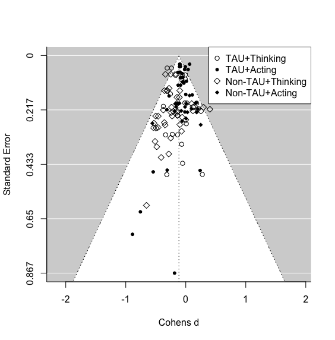

```{r setup, include=FALSE}
knitr::opts_chunk$set(echo = TRUE)
op0 = function(x, d=0) sprintf(paste0("%1.",d,"f"), x) 
op = function(x, d=2) sprintf(paste0("%1.",d,"f"), x) 
```

# Introduction

Suicidal thoughts and behaviours are both a challenge for public health and for service providers, given that annually 138 Million people experience suicide ideation, 20.7 Million people attempt suicide [@borges2010] and around 700.000 people die by suicide [@worldhealthorganization2021]. Still only 17% to 56% of them receive treatment [@bruffaerts2011]. Besides these undressed needs, low treatment rates are linked to two structural barriers: Treatment cost and availability [@bruffaerts2011].

Improving affordability and accessibility of treatment means to provide suicide specific care in terms of tailored interventions according to the patients stage of suicidal progression, rather than using a one fits all solution. It has been suggested to implement a stepped care approach, least restrictive care at early stages and to increase restrictions gradually with advancement of suicidal progression [@jobes2018]. In this sense, easily available and affordable treatment can lower treatment barriers and involve individuals otherwise hesitating to seek help at early suicidal stages [@bruffaerts2011]. Early interventions at the stage of suicide ideation, have been suggested to lower human suffering and to prevent future suicides [@zuromski2019].

Distance based programs are least restrictive treatments, in terms of local availability, affordability and service opening hours. Under-serviced areas can be supported by both tele-health and Apps. And while in the short term the development and evaluation of Apps and tele-health interventions are expensive, these are less expensive than individual psychotherapy, when a large amount of people are treated.

During the past two decades a number of randomized control trials examining distance based programs have been published. Starting at the turn of the millennium, with studies using phone-calls [@evans1999] and post-cards [@motto2001], leading to crisis hotlines and e-mail follow-ups [@luxton2020]. Recently the field has expanded to online programs [@vanspijker2014; @franklin2016] and since the Covid-19 outbreak increasingly to tele-health approaches [@fernandez2021]. Several Meta-analyses have been published on subsets of distance based programs [@milner2015; @torok2020].

To give recommendations for future research, our meta-analysis differentiated between autonomous interventions (i.e. apps, online programs) and human involved interventions (phone calls, postcards, tele-health), which allows to investigate, whether the scalability of autonomous interventions can be utilized without risking effectiveness. To reach as many suicidal individuals as possible in early stages of progression, distance based programs need to be scalable and cost-effective. Autonomous interventions have superior scalability compared to human involved interventions [@batterham2015], as they are less expensive per intervention, less restricted by service opening hours, they are translatable, and immediately available.

In order to draw practical conclusions we asked three questions, implemented as moderation analyses: (a) Whether distance based programs are effective against suicide ideation and/or against suicidal behaviours, (b) How stable these interventions are over time and (c) Whether effectiveness of such programs was independent from the chosen control groups.

## Methods

The systematic search followed the Preferred Reporting Items for Systematic Reviews and Meta-Analyses guidelines [@page2021] and was Pre-Registered on Prospero under the pre-registration number: CRD42020218791.

## Systematic Search

Search strings were defined using repeated searches combining the terms suicide prevention OR intervention, with the intervention types, (e.g.) Letter, App, Web-based, OR distance. The resulting search string was tested and refined using two related meta-analyses, focusing on human involved distance based interventions [@milner2015] and autonomous interventions [@torok2020] (see Supplement A for the final strings).

Once search strings were established, the first one hundred search results of Web of Science were examined together by the authors J.S. and K.R., establishing a common degree of understanding. After which, both authors independently searched Web of Science, Scopus and Pubmed; Systematic searches were last updated on the ...... . Cohen's kappa between both authors was 0.806. [INTERNAL: As of 30.09 in WOS no new entries]

## Inclusion and exclusion criteria

All peer reviewed randomized control trial studies were included, which investigated any form of distance based programs aimed at preventing self-harming thoughts and/or behaviours, such as suicidal ideation, suicidal planning, suicide attempts, non-suicidal self-injury (NSSI), and suicide. Face-to-face meetings were allowed, if these were not part of the intervention - i.e. for informing, testing or screening purposes.

Interventions which aimed at psychiatric disorders as a primary outcome and combined outcome measures, such as the total score of SBQ-R, summing thoughts and behaviours in a total score were excluded. Further, blended programs, such as phone-calls including home visits were excluded.

## Data Extraction and Coding

Data was coded independently by two authors (J.S and K.R.). Where possible non-imputed results, were coded. The following variables were extracted: Author, Year, control group of study, Country of Study, Sample type, sample size, intervention type, sex ratio, mean age, mean age(SD), the outcome name (e.g. self-harm), intervention duration in weeks, the participant attrition rate, the follow up time, standard mean difference (*SMD)* and variance of *SMD*. In addition, all outcomes were coded for the moderation analysis into subgroups (see Table 1).

+-----------------+---------------------------------------------------------------------------------------------+
| Moderator group | **Outcome Name**                                                                            |
+=================+=============================================================================================+
| Acts            | Suicide, suicide attempts, self harming behaviours.                                         |
+-----------------+---------------------------------------------------------------------------------------------+
| Thoughts        | Suicidal thoughts, suicidal ideation, suicide plans.                                        |
+-----------------+---------------------------------------------------------------------------------------------+
| Human involved  | Phone calls, cognitive behavioural treatment, personalized letters or personalized e-mails. |
+-----------------+---------------------------------------------------------------------------------------------+
| Autonomous      | Applications, websites, non-individualized letters or non-individualized e-mails.           |
+-----------------+---------------------------------------------------------------------------------------------+

: Outcome allocation to Moderator Analyses

The authors compared finalized coding sheets, discussed differences and re-coded affected studies until a unanimous result was achieved (see Appendix).

## Risk of bias and publication bias

Risk of bias was assessed using the RoB-2 [@sterne2019] and Trim and Fill was used as the publication bias detection [@fernandez-castilla2021; @renkewitz2019].

## Statistical Method

To incorporate all outcomes of interest we used a three level meta-analysis [@vandennoortgate2015; @cheung2019], with Robust variance estimation (RVE) [@hedges2010; @moeyaert2017]. RVE return valid confidence intervals in presence of dependent data [@park2019]. While the three level model allowed for outcome-level heterogeneity investigation [@vandennoortgate2013], RVE return valid confidence intervals in presence of dependent data [@park2019]. Models were fitted with restricted maximum likelihood estimation (REML), RVE correction was based on @pustejovsky2016.

Calculations were done in R [@rcoreteam2020] using the package *metafor* for the three level model [@viechtbauer2010c] and the package *clubSandwich* [@pustejovsky2021a] for the RVE correction.

Calculations were done in R [@rcoreteam2020] using the package metafor for the three level model [@viechtbauer2010c] and the package clubSandwich [@pustejovsky2021a] for the RVE correction. All Data needed for full reproducibility are available on Github.[^1]

[^1]: Link: <https://github.com/jim-schmeckenbecher/Distance-based-Interventions> . Included are R-Code, Maker-File, RmD, the associated Tex File and a lock file reporting the precise R-environment in which the analyses were done.

## Sensitivity Analysis

Given that NSSI [@americanpsychiatricassociation2013a] and suicidal behaviours [@joiner2005] ***may*** ***{Corr. Plener: delete may}***differ qualitatively, we employed two sensitivity analyses: (a) Including Non-Suicidal Self-Injury (NSSI) as an outcome, (b) Excluding suicide cases as an outcome.

## Deviation from Pre-Registered Report

Given most recent developments in meta-analysis research we adapted the procedure as follows: Firstly instead of the complex multi-level model , we employed a hybrid model of RVE correction and multilevel method [@pustejovsky2021], thereby improving efficiency and reducing risk of bias. Secondly, we followed the publication bias detection method recommended by @fernandez-castilla2021, although following the originally planned method [@renkewitz2019] would generate the same results.

# Results

```{r include = FALSE}
source("04_Code.R", local = knitr::knit_global())

```

## Emerged Data

We identified 3,287 papers in the databases and additional 11 studies from other sources (see Flow Chart), in the end `r max(Total$Study_ID)` independent studies were included in the analysis. The difference between included studies in the Flow chart and reported independent studies is explained by follow-up studies that use the same sample as their parent study. These follow-up studies are reported as studies, but because they are statistically dependent to their parent, they were treated as dependent within our meta-analysis. Further one study included 3 statistically independent RCT trials [@franklin2016].


Overall, `r max(Total$Outcome_ID)` outcomes emerged, with `r sum(Total$Thinking)` outcomes of the category thinking, predominantly ideation and planning, and `r max(Total$Outcome_ID) - sum(Total$Thinking)` outcomes of the category acting, including studies examining mostly deliberate self-harm, self-harm and suicide attempts.

`r max(Total$Outcome_ID) - sum(Total$Autonomous)` outcomes were found in the human involved interventions category and `r sum(Total$Autonomous)` outcomes were found for autonomous interventions. The median duration of studies was `r op(median(Study_avarage$Duration_weeks))` weeks, with a range of `r min(Total$Duration_weeks)` to `r max(Total$Duration_weeks)` weeks. The median time between post-intervention measures and follow up measures was `r median(median(Study_avarage$Follow_up_Time, na.rm=TRUE))` weeks, with a range of `r max(Total$Follow_up_Time,  na.rm = TRUE)` weeks to `r min(Total$Follow_up_Time,  na.rm = TRUE)` weeks.

The median attrition rate was `r op(median(Study_avarage$Total_Attrition, na.rm=TRUE))` % with a maximum of `r max(Study_avarage$Total_Attrition, na.rm=TRUE)` % and a minimum of 0 %.\

### Sample Characteristics

In total `r Postn` participants were included at post-intervention and *n=* `r sum(Study_avarageFollow_up$n)` at follow up. Out of all, `r op(mean(Study_avarage$Sex_Female))` % female and on average `r op(mean(Study_avarage$Age_.mean.,na.rm=TRUE))` (SD= `r op(mean(Study_avarage$Age_.SD., na.rm=TRUE))`) years old. In studies the youngest reported mean sample age was `r op(min(Study_avarage$Age_.mean.,na.rm=TRUE))` (SD= 1.4) years, the oldest mean sample age was `r op(max(Study_avarage$Age_.mean.,na.rm=TRUE))` (SD= 11.3)years.

Out of a total of n= `r max(Total$Study_ID)` studies, most data was retrieved from westernised educated industrialised democracies (WEIRD), predominantly the United States (*k=* 10), followed by Australia (*k* = 8). From non-westernised educated industrialised democracies *k = 6* studies emerged.

## Main Analysis

Distance Based Interventions were effective against suicidal thoughts and behaviours, standardized mean difference (SMD) = `r op(OverallRVECI$beta)` CI95%[`r op(OverallRVECI$CI_L)`; `r op(OverallRVECI$CI_U)`]; Heterogeneity was significant at *Q* (df = `r Overall$ddf[[1]]`)= `r op(Overall$QE)`, *p =* `r op(Overall$QEp)`.

Distance based Interventions are more effective against suicidal thoughts than suicidal behaviours (*SMD=* `r op(Overall.TRVECI$beta[2])` CI95%[`r op(Overall.TRVECI$CI_L[2])`; `r op(Overall.TRVECI$CI_U[2])`]). The average effectiveness against suicidal thoughts was *SMD=* `r op(Overall.T2RVECI$beta[1])` CI95%[`r op(Overall.T2RVECI$CI_L[1])`; `r op(Overall.T2RVECI$CI_U[1])`], while suicidal behaviours was lower at around *SMD=* `r op(Overall.TRVECI$beta[1])` CI95%[`r op(Overall.TRVECI$CI_L[1])`; `r op(Overall.TRVECI$CI_U[1])`]. Heterogeneity was non-significant *Q* (df = `r Overall.T$ddf[[1]]`) = `r op(Overall.T$QE)`, *p =* `r op(Overall.T$QEp)`.

Given small study numbers, the comparison of waitlist and attention placebo groups showed statistically not trustworthy results according to the profile likelihood plots.

Therefore, waitlist and attention placebo were combined into a combined control group, and compared to TAU.

Comparing the combined control-group vs. TAU, retuned that Distance Based Interventions giving alongside TAU were significantly less effected (S*MD=* `r op(Overall.CRVECI$beta[1])` CI95%[`r op(Overall.CRVECI$CI_L[1])`; `r op(Overall.CRVECI$CI_U[1])`]), than studies giving Distance Based Interventions using a waitlist or attention placebo control group. Heterogeneity remained significant at *Q* (df = `r OverallC$ddf[[1]]`) = `r op(OverallC$QE)`, *p =* `r op(OverallC$QEp)`.

Covariance was investigated by simultaneous visualization of control-group and outcome category. Suicidal behaviours and suicidal thoughts were unevenly distributed between different control-group types (see figure 2).

An exploratory analysis including both moderators was implemented.

When including both moderators, the difference between control groups became non- significant, with *SMD=* `r op(Overall.TRVECITT$beta[3])` CI95%[`r op(Overall.TRVECITT$CI_L[3])`; `r op(Overall.TRVECITT$CI_U[3])`], but suicidal acts and suicidal thoughts remained a significant moderator, with *SMD =* `r op(Overall.TRVECITT$beta[2])` CI95%[`r op(Overall.TRVECITT$CI_L[2])`; `r op(Overall.TRVECITT$CI_U[2])`] in favour of suicidal thoughts; heterogeneity was not significant at *Q* (df = `r Overall.TT$ddf[[1]]`) = `r op(Overall.TT$QE)`, *p =* `r op(Overall.TT$QEp)`.



Effectiveness of Distance Based Interventions decreased between time-points at *SMD =* `r op(Overall.FCRVECI$beta[2])` CI95%[`r op(Overall.FCRVECI$CI_L[2])`; `r op(Overall.FCRVECI$CI_U[2])`] non-significantly. Heterogeneity was significant at *Q* (df = `r OverallF$ddf[[1]]`) = `r op(OverallF$QE)`, *p =* `r op(OverallF$QEp)`.

Human involvement had with *SMD=* `r op(Overall.IRVECI$beta[2])` CI95%[`r op(Overall.IRVECI$CI_L[2])`; `r op(Overall.IRVECI$CI_U[2])`] an non-significant negative impact on effectiveness. Heterogeneity was significant at *Q* (df = `r Overall.I$ddf[[1]]`) = `r op(Overall.I$QE)`, *p =* `r op(Overall.I$QEp)`.

## Sensitivity Analysis

Both, inclusion of NSSI (k = 6) and exclusion of suicide studies (k= 4) had negligible impacts on the subgroup of behaviour outcomes. Inclusion of NSSI increased the effectiveness SMD= `r op(Overall.TRVE2$beta[1])` to SMD= `r op(Overall.TRVE$beta[1])`. and exclusion of suicide studies decreased effectiveness from SMD = `r op(Overall.TRVE$beta[1])` to SMD= `r op(Overall.TSRVE$beta[1])`.

## Publication Bias and Risk of Bias Assessment

Risk of bias of all *independent* studies was mixed (see Figure 3.). Using Trim and Fill, no publication bias could be observed.


# Discussion

In this meta-analysis we investigated the effectiveness of distance based programs in reducing suicidal thoughts and behaviours. On average distance based programs reduced both suicidal thoughts and behaviours. The quality of evidence was good, given a considerable number of RCTs, with a notable number of high and medium quality studies and no observed publication bias.

### Contextualising results with other Meta-Analyses

To contextualise our results and define where Distance Based Interventions are best used, we searched Web of Science for all meta-analysis published between 2021 and 2018 using "suic" and "therap\*".

#### Effectiveness of distance based programs for suicidal behaviours

We showed that suicidal behaviours were reduced (`r op(Overall.TRVECI$beta[1])` CI95%[`r op(Overall.TRVECI$CI_L[1])`; `r op(Overall.TRVECI$CI_U[1])`]) by distance based programs.

Our search returned two meta-analysis that reported on reductions of suicidal behaviours, due to face-to-face interventions, without limiting itself to any specific population [@hofstra2020; @briggs2019]. While both meta-analysis have their own limitations, @briggs2019 only including psycho-analytical treatments and @hofstra2020 including any intervention published between 2011-2017 which includes a control group, these are the closest to general and representative for the research field.

Starting with the therapy unspecific results. Suicide attempts are reduced significantly more effective than Distance Based Interventions by outpatient speciality mental health setting interventions (SMD =-0.705 [95% CI -1.275; -0.135]) @hofstra2020, followed by psychiatric wards in general hospitals (SMD=-0.483[95% CI -0.892; -0.073]) and emergency room setting suicide prevention (SMD=-0.319 [95% CI -0.528; -0.110]). All of these results have very large confidence intervals, in turn none differ significantly and psychiatric wards in general hospitals do not even differ significantly from Distance Based Interventions in their effectiveness. But, given their mean effect sizes, it is more than reasonable to expect that all these intensive intervention prove superior, given more research.

For therapy specific interventions, namely psychoanalytic face-to-face interventions, @briggs2019 reported non-significantly stronger results, for suicide attempts *SMD =* -0.24 CI95%[-0.50;0.03] and partially significantly stronger results for self harm, ranging between *SMD*= -0.73 CI95% [-1.22;-0.22] and *SMD*= -0.15 CI95% [-3.88;0.09]; depending on how self harm was measured. The results for suicide attempts where non-significantly different between @briggs2019 psychoanalytical interventions and any form of intervention of @hofstra2020. This again shows how underpowered suicide research often is.

Given that only a meta-analysis for psycho-analytical treatments emerged, it maybe argued that other treatments are more effective against suicidal behaviours, such as MBT, DBT, CBT. To argue for or against this point we have to include meta-analysis using youth samples, as no meta-analysis investigating this point emerged for the general population. Drawing on this network meta-analysis (NMA) [@bahji2021] we can observe strong mostly statistically non-significant difference between different therapy schools. For self harm at the end of therapy the strongest results were delivered by eclectic therapy (ET), followed by dialectical behavioural therapy and short-term psychoanalytic psychotherapy (STPP), the worst results were delivered by brief Interventions, cognitive analytic therapy and family-based therapy (FT). At follow up best were metallization-based therapy, STPP and cognitive behavioural therapy, the worst were FT, supportive therapy, ET. Of note is that the intervention with the best outcome at the end of the treatment ET was the worst at follow up, leading to an increase in self harm (*SMD*= 0.6498[CI95% 0.006; 1.29]).

Based on these results, at least in youth and adolescent samples, psycho-analytical approaches are among the most effective forms of therapy to treat self harm. But again research activity is mostly to low to actually differentiate therapies into significantly more and less effective therapies. Although this comparison shows that it is reasonable to treat psychoanalytical therapies as representative for face-to-face interventions for comparison to Distance Based Interventions.

Although distance-based interventions seem to have a small effect size in comparison to face-to face interventions, especially high-frequency long-term interventions and inpatient treatment. We can also see where Distance Based Interventions have a role in the prevention of suicidal behaviour due to their availability, scalability and cost-efficacy.

Even more, it remains to be analysed, whether the higher effectiveness of face-to-face interventions, which is based on rather small samples, would remain superior when their power would be increased. For example, although the effect size of the meta-analysis by @briggs2019 is likely four times higher than the effect size of Distance Based Interventions, the effect reported here is based on a larger data set, therefore significant, while the likely larger effect sizes in @briggs2019 remain insignificant, due to low power.

When we also draw on the effect-size estimates and their confidence intervals, we can observe the clinical potential of an intervention. For example, the effect size reported by @briggs2019 against suicide attempts, expressed as Number Needed to Treat, (NNT) is = 7.4 CI95% [Inf; 3.6], means that the interventions may be ineffective (Infinite number needed), but it could help up to every fourth person. In contrast, our results of distance based programs, expressed as *NNT =* 29.5 CI95% [59; 22.1] means that a reduction will occur with 95% certainty, but *at best* only every twenty-second person will be helped and on average one of 30 interventions will be helpful. Given the seriousness of suicidal behaviours and the currently low effectiveness of interventions against it, more research on potentially more effective treatment is needed. For example, we suggest more research into high frequency interventions and on the question if the trend of larger effect-sizes in psychoanalytical therapies [@briggs2019] and other promising approaches is retained, given more data. However, despite the low effect of distance based programs on suicidal behaviour, they nevertheless might have a role in the spectrum of preventive approaches. Especially the fact of high barriers to treatment seeking, especially to face-to-face treatment, are an argument to disseminate Distance Based Interventions as a means for involvement where other treatment is not available or not accepted by those in need.

### Effectiveness of distance based programs for suicidal thoughts

Similarly to suicidal behaviours, suicidal thoughts were reduced by distance based programs (`r op(Overall.T2RVECI$beta[1])` CI95%[`r op(Overall.T2RVECI$CI_L[1])`; `r op(Overall.T2RVECI$CI_U[1])`]).

As the two meta-analysis using general populations [@hofstra2020; @briggs2019] did not include any suicidal thoughts measures a direct contextualisation is not possible. Instead we collected all meta-analysis, which used specific populations and reported suicide ideation scores. We assume that if the scores are comparable over different specific populations, they can be generalized.

In total 4 meta-analysis [@bahji2021; @bornheimer2020; @chen2021; @kothgassner2020] emerged. Of these two [@bahji2021;@kothgassner2020] used youth samples and two used clinical samples, one of paitents with psychosis [@bornheimer2020] and one of patients with BPD [ @chen2021]. One meta-analysis used a NMA [@bahji2021], the rest used Hedges-Olkin approaches.

Reported reductions of suicide ideation did not differ between studies: SMD= -0.17 (95% CI:-0.33; -0.017) [@bornheimer2020], SMD = -0.31, [95% CI: -0.50;--0.12] [@kothgassner2020] and SMD = -0.26, [95% CI: -0.74;0.21] [@chen2021]; @bahji2021 NMA did not report a study average effect. Both @bahji2021 and @kothgassner2020 reported effects split up according to the psychotherapeutic schools, regarding suicide ideation measures, none differed significantly form one another.

Given the stability of suicide ideation reductions other different populations, psychotherapeutic schools and methods, we see it as possible, to make a cautious comparison between the results of these meta-analysis and the results of our Distance Based Interventions, even though populations differed.

Results of Distance Based Interventions are line with face-to-face interventions according to [@bahji2021; @bornheimer2020; @chen2021; @kothgassner2020]. With only one face-to face interventions significantly exceeded the effectiveness of Distance Based Interventions and only at follow up, not at post treatment, namely mentalization-based therapy (SMD =--1.22 [CI95%: -2.18; --0.26] [@bahji2021].

### Research recommendations

According to our results, autonomous distance based interventions (ADBI) (SMD= `r op(Overall.I2RVECI$beta[1])` CI95%[`r op(Overall.I2RVECI$CI_L[1])`; `r op(Overall.I2RVECI$CI_U[1])`]), were as effective as human involved interventions (SMD= `r op(Overall.IRVECI$beta[1])` CI95%[`r op(Overall.IRVECI$CI_L[1])`; `r op(Overall.IRVECI$CI_U[1])`]). But ADBI promise a better scalability [@batterham2015], making them more feasible for studies with larger sample sizes and replication studies; something that holds true for almost any psychotherapeutic intervention.

Studies with large sample sizes or study sets using close replications are needed, as only these allow us to control for the characteristics of distance based interventions and by such, to understand which components are most effective.

In general, the assumptions about Distance Based Interventions (DBI) for mental health often lack evidence [@musiat2014]. For example, some stated advantages of Distance Based Interventions in suicide prevention are still unproven assumptions, for example that 24h availability of such an intervention might be advantageous. The best proven assumptions derived from meta-analytical evidence are delivered for cost effectiveness, acceptability and satisfaction of DBIs. However, this evidence is available for mental health interventions in general [@eze2020; @musiat2014], but not for the primary endpoint of suicidal behaviour or thoughts.

In this sense, the development of well powered ADBIs for suicide prevention is still is in its infancy and needs to addressed in future more scrupulously.

### Implications for clinical practice

#### Placing Distance Based Interventions on the stepped care model

The stepped care model for suicide care [@jobes2018] includes 5 levels of intervention, ranging from least restrictive Telephone (level 1), Brief interventions (2), outpatient care (3), partial hospitalisation (4) to most restrictive interventions like inpatient care/full hospitalisation(5).

As such both the least costly and restrictive level of stepped care, 'telephone interventions and follow ups' and the second least costly and restrictive level, 'Brief interventions and follow ups' can be supplemented or supplanted by Distance Based Intervention. Further, given that effect-sizes of Distance Based Interventions were similar to other face-to-face interventions, DBI can be used to supplement all three remaining levels of care.

For the best time to intervene this meta-analysis, together with observed meta-analysis shows that all interventions, face-to-face-, Human-Involved Distance Based- as well as autonomous Interventions, at all time-points, are effective in reducing suicide. But, all of these interventions were more effective against suicidal thoughts than against suicidal acts. Therefore, there is a strong argument for the implementation of such interventions among individuals with suicide ideation, as recently discussed by @jobes2019 .

The availability of face-to-face interventions in mental health clinics and among individual mental health professionals such as psychiatrists and psychotherapists is unevenly distributed geographically [@kapusta2010; @pirkola2009] and may be limited in pandemic containment efforts against Covid-19. The resulting unavailability may be compensated for by ADBIs, which are not affected by geographic distribution or lockdowns. In addition the reality of psychiatric treatment includes high costs for individuals or the public health system [@wittchen2011a], depending on whether psychiatric treatment is covered by insurance. This often results in long waiting times for patients in need [@zepf2003]. In both cases, ADBIs can help mitigate the negative effects of barriers to help seeking, by offering an intermediate alternative, thereby bridging waiting times and at lower costs. Finally ADBI can help to scale up mental health services especially in countries with limited mental health expenditures and low resources, such as low and middle income countries (LMIC), as called by @chisholm2007 and thereby contribute to the Sustainable Mental Health Development Goals, set out be the UN [@patel2018].

## Limitations

Given our comprehensive approach, some limitations should be noted. Firstly, we did not include any grey literature. This can cause selection bias, as the publication bias suppresses non-significant results. However RCT studies in a multidisciplinary field a rather unlikely. We expect non-publication due to reporting non-significant results is unlikely, given that almost all considered studies included non-significant results. This decision reduced work load notably and is in line with previous meta-analyses to this field [@torok2020; @milner2015 ].

The second potential limitation is that most studies included in this meta-analysis are already covered by different previously published meta-analyses [@torok2020; @milner2015]. However, these previously published meta-analyses used the Hedges-Olkin meta-analysis which allows only the inclusion of one independent data point, in contrast to our MLM analysis, which allows inclusion of all relevant data [@cheung2019].

Utilizing all relevant data has multiple advantages, such as higher precision (a) and less bias risk(b). (a) Including multiple non independent data points per study increases precision. Further it allows important moderator analysis to be implemented in one model, which allows to weigh evidence according to its information value. In contrast, previous meta-analysis had to use independent subgroup analyses, which lowers precision notably and only allows for an indirect comparisons of effectiveness. (b) Bias risk, as stated Hedges-Olkin meta-analyses [@torok2020; @milner2015] must select one outcome per independent analysis. This can result in a selection bias can be introduced therefore not be excluded in these older meta-analyses. Based on these points and the fact that we updated and broaden the systematic searches of previous meta-analysis, the current meta-analysis substantially adds to the research field.

Despite the above stated advantages a multilevel meta-analysis produces further potential limitations. First, the employed method requires more studies to reach adequate power. The number of included studies was relatively low, thus potentially leading to underpowered results [@tanner-smith2014]. But results were reliable, based on Profile Likelihood Plots ( R package *metafor)* and the reported degrees of freedom reported by the RVE Correction (R package *clubsandwich*) [@pustejovsky2016]. Second, RVE corrected models do not report heterogeneity estimations, therefore heterogeneity estimations of the MLM were reported. However *Q-* test results are not biased by dependency and therefore statistically valid, while power of the *Q*-Test was sufficient [@maeda2016].

## Conclusion

The presented results of the MLM are based on `r max(Total$Study_ID)` published peer-reviewed RCT trials on Distance Based Interventions. With an adequate power, no indication for publication bias and manageable heterogeneity. The results suggest that DBI, particularly autonomous Distance Based Interventions, are an effective and affordable possibility to support treatment, specifically against suicidal thoughts and in situations where availability of face-to-face treatments is limited. These results are encouraging as affordable and available DBI mean higher accessibility, in turn promising a reduction of human suffering and health care costs.

# References

```{=tex}
\begingroup
\setlength{\parindent}{-0.5in}
\setlength{\leftskip}{0.5in}
```
References marked with an asterisk indicate studies included in the meta-analysis.

::: {#refs}
:::

\endgroup

<div>

</div>

# Appendix

## Online Supplement 1

### Search Strings:

Note: Search string was adapted in Scopus adding: TITLE-ABS-KEY. This is implied when using WOS and Pubmed. As in WOS and Pubmed Title, Abstract and Keywords were also searched, both strings are in practice identical.

#### For WOS and Pubmed

(("Suic\*" OR "Suicide prevention" OR "self harm\*" OR "self poisoning\*" OR "self injur\*" OR "self mutilation" ) AND ("telehealth"OR"postcard\*"OR "onlin\*"OR"Online Intervention" OR "Online Prevent\*" OR "E Intervention" OR "E-Intervention" OR "E Prevention" OR "Electronic Intervention" OR "Electronic Prevention" OR "Mobile Intervention" OR "Mobile Prevention" OR "Web-Based\*" OR "Web Based\*"  OR "Online Support" OR "E Therapy" OR "e-mail\*" OR "e mail\*" OR "App" OR "Apps" OR "App-Assis\*" OR "mobile-App" OR "mobile health intervention" OR "telephone" OR "phone based" OR "letter\*") AND (RCT OR Random\*))

#### Scopus:

( TITLE-ABS-KEY ( ( "Suic\*"  OR  "Suicide prevention"  OR  "self harm\*"  OR  "self poisoning\*"  OR  "self injur\*"  OR  "self mutilation" )  AND  ( "telehealth"  OR  "postcard\*"  OR  "onlin\*"  OR  "Online Intervention"  OR  "Online Prevent\*"  OR  "E Intervention"  OR  "E-Intervention"  OR  "E Prevention"  OR  "Electronic Intervention"  OR  "Electronic Prevention"  OR  "Mobile Intervention"  OR  "Mobile Prevention"  OR  "Web-Based\*"  OR  "Web Based\*"  OR  "Online Support"  OR  "E Therapy"  OR  "e-mail\*"  OR  "e mail\*"  OR  "App"  OR  "Apps"  OR  "App-Assis\*"  OR  "mobile-App"  OR  "mobile health intervention"  OR  "telephone"  OR  "phone based"  OR  "letter\*" )  AND  ( rct  OR  random\* ) ) )
