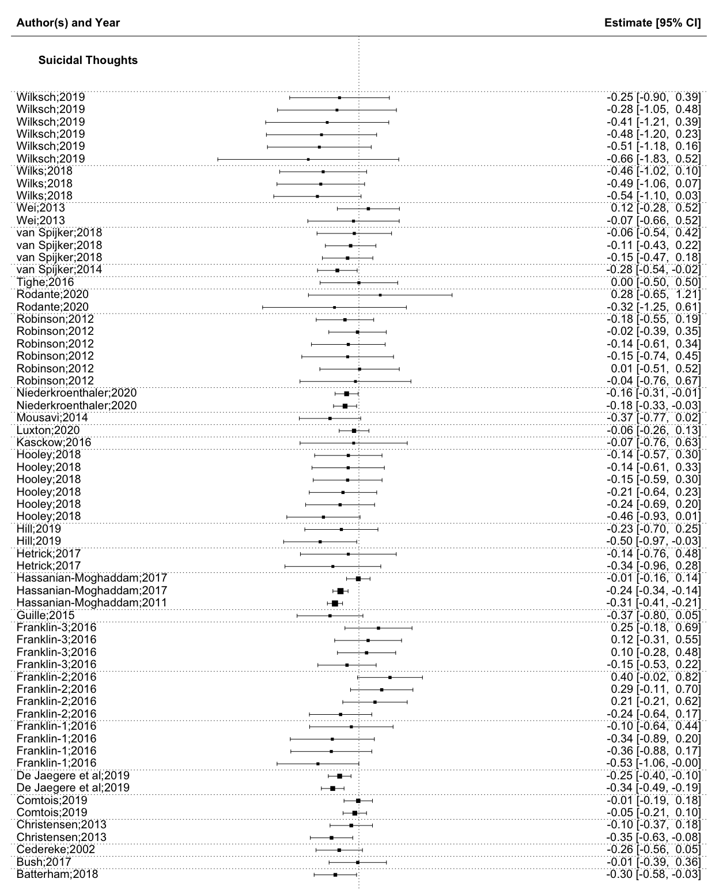
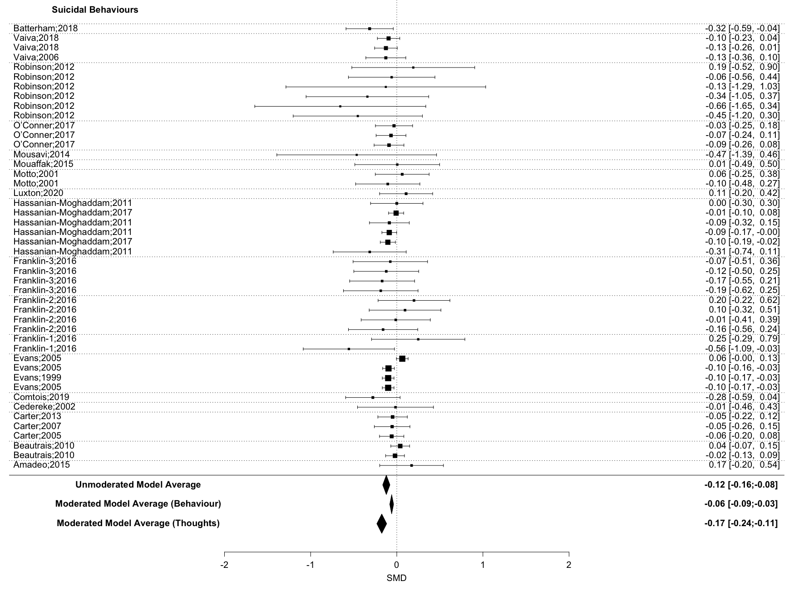
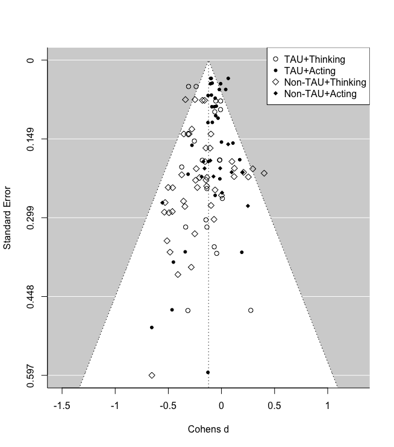
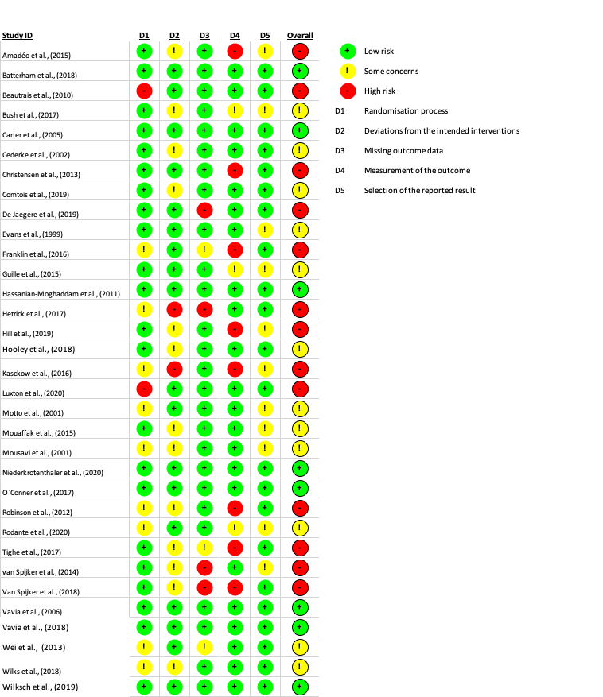

```{r setup, include=FALSE}
knitr::opts_chunk$set(echo = TRUE)
op0 = function(x, d=0) sprintf(paste0("%1.",d,"f"), x) 
op = function(x, d=2) sprintf(paste0("%1.",d,"f"), x) 
```

# Introduction

Suicidal thoughts and behaviours are both a challenge for public health and for service providers, given that annually 138 million people experience suicide ideation, 20.7 million people attempt suicide [@borges2010] and around 700,000 people die by suicide [@worldhealthorganization2021]. Still only 17% to 56% of persons experiencing suicidal thoughts and behaviours receive treatment [@bruffaerts2011]. Besides these undressed needs, low treatment rates are linked to two structural barriers such as: Treatment cost and availability [@bruffaerts2011].

Improving affordability and accessibility of treatment means to provide suicide-specific care in terms of tailored interventions according to the patient's stage of suicidal progression (e.g., pre-motivation, ideation only, plan/attempt; [@oconnor2011]), rather than using a one fits all solution. It has been suggested to implement a stepped care approach: least restrictive care at early stages and to increase restrictions gradually with advancement of suicidal progression [@jobes2018]. In this sense, easily available and affordable treatment can lower treatment barriers and involve individuals otherwise hesitating to seek help at early suicidal stages [@bruffaerts2011]. Early interventions at the stage of suicide ideation, have been suggested to lower human suffering and to prevent future suicides [@zuromski2019].

Distance Based Interventions (DBI) are least restrictive treatments, in terms of local availability, affordability and available service hours. Under-serviced areas can be supported by both tele-health and apps. While in the short term the development and evaluation of Apps and tele-health interventions are expensive, these are less expensive and less resource-intensive than individual psychotherapy, when a large amount of people are treated.

During the past two decades a number of randomized control trials examining DBI have been published. Starting at the turn of the millennium, with studies using phone-calls [@evans1999] and post-cards [@motto2001], leading to crisis hotlines and e-mail follow-ups [@luxton2020]. Recently the field has expanded to online programs [@vanspijker2014; @franklin2016] and since the Covid-19 outbreak increasingly to tele-health approaches [@fernandez2021]. Several Meta-analyses have been published on subsets of DBI [@milner2015; @torok2020].

To give recommendations for future research and clinical practice, our meta-analysis differentiated between autonomous DBI (aDBI) (i.e. apps, online programs) and human DBI (hDBI) (phone calls, postcards, tele-health), which allows to investigate, whether the scalability of hDBI can be utilized without risking effectiveness. To reach as many suicidal individuals as possible in early stages of progression, distance based programs need to be scalable and cost-effective. aDBI have superior scalability compared to hDBI [@batterham2015], as they are less expensive per intervention, less restricted by available service hours, more translatable, and immediately available.

In order to draw practical conclusions we asked three questions, implemented as moderation analyses: (a) Whether DBI are effective against suicide ideation and/or against suicidal behaviours, (b) How stable these interventions are over time and (c) Whether effectiveness of such programs was independent from the chosen control groups (TAU/Attention Placebo/waitlist).

## Methods

The systematic search followed the Preferred Reporting Items for Systematic Reviews and Meta-Analyses guidelines [@page2021] and was Pre-Registered on Prospero under the pre-registration number: CRD42020218791.

Search strings were defined using repeated searches combining MeSH terms relating to suicide prevention OR intervention, with the intervention types, (e.g.) Letter, App, Web-based, OR distance. The resulting search string was tested and refined using two related meta-analyses, one on hDBI [@milner2015] and one aDBI [@torok2020] (see Appendix for final strings).

Once search strings were established, the first one hundred search results of Web of Science were examined together by the authors J.S. and K.R., establishing a common degree of understanding. After which, both authors independently searched Web of Science, Scopus and Pubmed; Systematic searches were last updated in December 2021 . Cohen's kappa between both authors was 0.806.

## Inclusion and exclusion criteria

All peer reviewed randomized control trial studies were included, which investigated any form of DBI with at least one primary outcome being self-harming thoughts and/or behaviours, such as suicidal ideation, suicidal planning, suicide attempts, and suicide. Face-to-face meetings were allowed, if these were not part of the intervention - i.e. for informing, testing or screening purposes.

All suicidal thoughts and behaviour outcomes of applicable studies were coded, excluding combined outcome measures, such as the total score of Suicidal Behaviours Questionnaire-Revised (SBQ-R) which sums lifetime thoughts and behaviours in a total score.

## Data Extraction and Coding

Data was coded independently by two authors (J.S and K.R.). Where possible non-imputed results, were coded. The following variables were extracted: Author, Year, control group of study, country of study, sample type, sample size, intervention type, sex ratio, mean age, mean age (*SD*), the outcome name (e.g. suicidal ideation), intervention duration in weeks, the participant attrition rate, the follow-up time, standard mean difference (*SMD)* and variance of *SMD*. In addition, all outcomes were coded for the moderation analysis into subgroups (see Table 1).

+-------------------+--------------------------------------------------------------------------------------------------------------+
| Moderator group   | **Outcome Name**                                                                                             |
+===================+==============================================================================================================+
| Acts              | Suicide, suicide attempts, self harming behaviours.                                                          |
+-------------------+--------------------------------------------------------------------------------------------------------------+
| Thoughts          | Suicidal thoughts, suicidal ideation, suicide plans.                                                         |
+-------------------+--------------------------------------------------------------------------------------------------------------+
| Human involved    | Phone calls, cognitive behavioural treatment, personalized letters or personalized e-mails.                  |
+-------------------+--------------------------------------------------------------------------------------------------------------+
| Autonomous        | Applications, websites, non-individualized letters or non-individualized e-mails.                            |
+-------------------+--------------------------------------------------------------------------------------------------------------+
| TAU               | TAU, enhanced TAU, intensive case monitoring,                                                                |
+-------------------+--------------------------------------------------------------------------------------------------------------+
| Attention Placebo | Attention placebo, control article, journalling, attention control, control program, body positivity images. |
+-------------------+--------------------------------------------------------------------------------------------------------------+
| waitlist          | no contact, reminder letter at the end, waitlist, no interventions                                           |
+-------------------+--------------------------------------------------------------------------------------------------------------+

: Outcome allocation to Moderator Analyses

The authors compared finalized coding sheets, discussed differences and re-coded affected studies until a unanimous result was achieved.

Risk of bias was assessed using the RoB-2 [@sterne2019] and Trim and Fill was used as the publication bias detection [@fernandez-castilla2021; @renkewitz2019].

## Statistical Method

To incorporate all outcomes of interest we used a three level meta-analysis [@vandennoortgate2015; @cheung2019], with Robust variance estimation (RVE) [@hedges2010; @moeyaert2017]. RVE return valid confidence intervals in presence of dependent data [@park2019]. While the three level model allowed for outcome-level heterogeneity investigation [@vandennoortgate2013], RVE return valid confidence intervals in presence of dependent data [@park2019]. Models were fitted with restricted maximum likelihood estimation (REML), RVE correction was based on
Pustejovsky and Tipton [-@pustejovsky2016].

Calculations were done in R [@rcoreteam2020] using the package metafor for the three level model [@viechtbauer2010c] and the package clubSandwich [@pustejovsky2021a] for the RVE correction. All data needed for full reproducibility, as well as all deviations from the preregistered Report are publicly available on Github.[^1]

[^1]: Link: [\<https://github.com/jim-schmeckenbecher/Distance-based-Interventions\>](https://github.com/jim-schmeckenbecher/Distance-based-Interventions){.uri}.

## Sensitivity Analysis and bias 

Given that NSSI [@americanpsychiatricassociation2013a] and suicidal behaviours [@joiner2005] differ qualitatively, we employed two sensitivity analyses: (a) Including Non-Suicidal Self-Injury (NSSI) as an outcome, (b) Excluding suicide deaths as an outcome.

Risk of bias was assessed using the RoB-2 [@sterne2019] and Trim and Fill was used as the publication bias detection [@fernandez-castilla2021; @renkewitz2019].

# Results

```{r include = FALSE}
source("04_Code.R", local = knitr::knit_global())

```

We identified 2,213 papers in the databases (see Flow Chart), in the end `r max(Total$Study_ID)` independent RCT trials were included in the analysis. The difference between included studies in the flow chart and reported independent RCT trials is explained by follow-up studies that use the same sample as their parent study. As these study pairs have the same sample we treated them as a single RCT. Further, one study included three statistically independent RCTs [@franklin2016].


Overall, `r sum(Total$count)` outcomes emerged, with `r sum(Total$Thinking)` outcomes of the category thinking, predominantly ideation and planning, and `r sum(Total$count) - sum(Total$Thinking)` outcomes of the category acting, including studies examining mostly deliberate self-harm, self-harm and suicide attempts.

`r sum(Total$count) - sum(Total$Autonomous)` outcomes were found in the hDBI category and `r sum(Total$Autonomous)` outcomes were found for aDBI. The median duration of studies was `r op(median(Study_avarage$Duration_weeks))` weeks, with a range of `r min(Total$Duration_weeks)` to `r max(Total$Duration_weeks)` weeks. The median time between post-intervention measures and follow-up measures was `r median(median(Study_avarage$Follow_up_Time, na.rm=TRUE))` weeks, with a range of `r max(Total$Follow_up_Time,  na.rm = TRUE)` weeks to `r min(Total$Follow_up_Time,  na.rm = TRUE)` weeks. Finally `r op0(sum(Total$TAU))` outcomes were based on TAU group comparisons, `r op0(sum(Total$wait))` outcomes were based on waitlist control groups and `r op0(sum(Total$Attention))` outcomes were based on attention placebo control groups.

The median attrition rate was `r op(median(Study_avarage$Total_Attrition, na.rm=TRUE))`% with a maximum of `r max(Study_avarage$Total_Attrition, na.rm=TRUE)`% and a minimum of 0%.

### Sample Characteristics

In total `r sum(Study_avaragePost$n)` participants were included at post-intervention and `r sum(Study_avarageFollow_up$n)` at follow-up. Out of all participants, `r op(mean(Study_avarage$Sex_Female))` % female and on average `r op(mean(Study_avarage$Age_.mean.,na.rm=TRUE))` (*SD*= `r op(mean(Study_avarage$Age_.SD., na.rm=TRUE))`) years old. In studies the youngest reported mean sample age was `r op(min(Study_avarage$Age_.mean.,na.rm=TRUE))` (*SD*= 1.46) years, the oldest mean sample age was `r op(max(Study_avarage$Age_.mean.,na.rm=TRUE))` (SD= 11.39)years.

Out of a total of `r max(Total$Study_ID)` studies, most data was retrieved from westernised educated industrialised democracies (WEIRD), predominantly the United States (*k=* 10), followed by Australia (*k* =9). From non-westernised educated industrialised democracies *5* studies emerged.

## Main Analysis

DBI were effective in reducing suicidal thoughts and behaviours, standardized mean difference (SMD) = `r op(OverallRVECI$beta)` CI95%[`r op(OverallRVECI$CI_L)`; `r op(OverallRVECI$CI_U)`]; Heterogeneity was significant at *Q* (df = `r Overall$ddf[[1]]`)= `r op(Overall$QE)`, *p =* `r op(Overall$QEp)`.

DBI are more effective against suicidal thoughts than suicidal behaviours (*SMD=* `r op(Overall.TRVECI$beta[2])` CI95%[`r op(Overall.TRVECI$CI_L[2])`; `r op(Overall.TRVECI$CI_U[2])`]). The average effectiveness against suicidal thoughts was *SMD=* `r op(Overall.T2RVECI$beta[1])` CI95%[`r op(Overall.T2RVECI$CI_L[1])`; `r op(Overall.T2RVECI$CI_U[1])`], while suicidal behaviours was lower at around *SMD=* `r op(Overall.TRVECI$beta[1])` CI95%[`r op(Overall.TRVECI$CI_L[1])`; `r op(Overall.TRVECI$CI_U[1])`]. Heterogeneity was non-significant *Q* (df = `r Overall.T$ddf[[1]]`) = `r op(Overall.T$QE)`, *p =* `r op(Overall.T$QEp)`. (See Figure 2)





Due to the small number of studies using waitlist, the comparison of waitlist and attention placebo groups were not trustworthy according to their profile likelihood plots [@raue2009].

Therefore, waitlist and attention placebo were combined into one control group, and compared to TAU.

Comparing the combined control-group vs. TAU, showed that DBI given alongside TAU was significantly less effective against suicidal thoughts or behaviours (*SMD=* `r op(Overall.CRVECI$beta[1])` CI95%[`r op(Overall.CRVECI$CI_L[1])`; `r op(Overall.CRVECI$CI_U[1])`]), than DBI given alongside a waitlist or attention placebo control group. Heterogeneity remained significant at *Q* (df = `r OverallC$ddf[[1]]`) = `r op(OverallC$QE)`, *p =* `r op(OverallC$QEp)`.

Possible covariance of control-group type (i.e. TAU vs. watilist and attention placebo) and outcome type (i.e. thinking vs. acting) was investigated. As suicidal behaviours and suicidal thoughts were unevenly distributed between studies using different control-group types (see figure 2), an exploratory analysis including both moderators was implemented. When including both moderators, the difference between control groups became non-significant, with *SMD=* `r op(Overall.TTRVECITT$beta[3])` CI95%[`r op(Overall.TTRVECITT$CI_L[3])`; `r op(Overall.TTRVECITT$CI_U[3])`], but suicidal acts and suicidal thoughts remained significant moderator, with *SMD =* `r op(Overall.TTRVECITT$beta[2])` CI95%[`r op(Overall.TTRVECITT$CI_L[2])`; `r op(Overall.TTRVECITT$CI_U[2])`] in favour of suicidal thoughts. Heterogeneity was not significant at *Q* (df = `r Overall.TT$ddf[[1]]`) = `r op(Overall.TT$QE)`, *p =* `r op(Overall.TT$QEp)`.



Effectiveness of DBI decreased between time-points at *SMD =* `r op(Overall.FCRVECI$beta[2])` CI95%[`r op(Overall.FCRVECI$CI_L[2])`; `r op(Overall.FCRVECI$CI_U[2])`] non-significantly. Heterogeneity was significant at *Q* (df = `r OverallF$ddf[[1]]`) = `r op(OverallF$QE)`, *p =* `r op(OverallF$QEp)`.

aDBI and hDBI did not differ significantly in effectiveness, *SMD=* `r op(Overall.IRVECI$beta[2])` CI95%[`r op(Overall.IRVECI$CI_L[2])`; `r op(Overall.IRVECI$CI_U[2])`], heterogeneity was significant at *Q* (df = `r Overall.I$ddf[[1]]`) = `r op(Overall.I$QE)`, *p =* `r op(Overall.I$QEp)`.

## Sensitivity Analysis and Bias

Both, inclusion of NSSI outcomes (*o* = `r sum(Total2$NSSI)`) and exclusion of suicide death outcomes (*o* = `r sum(Total$Suicide)`) had negligible impacts on the subgroup of suicidal behaviour outcomes. As the Inclusion of NSSI did not change the effectiveness of DBI, *SMD~-NSSI~*= `r Overall.TRVE2$beta[1]` compared to *SMD~+NSSI~*= `r Overall.TRVE$beta[1]`, and exclusion of suicide death outcomes did not change the effectiveness *SMD~+suicide\ death~* = `r Overall.TRVE$beta[1]` to *SMD~-suicide\ death~*= `r Overall.TSRVE$beta[1]`. It has to be noted that only Franklin et al. [-@franklin2016] reported NSSI measures in a study aimed at reducing suicidal behaviour and suicidal thoughts as a primary outcome.

Risk of bias of all *independent* studies was mixed (see Figure 3.). Using Trim and Fill, no publication bias could be observed.

{width="21cm"}

# Discussion

In this meta-analysis, we examined the effectiveness of DBIs in reducing suicidal thoughts and behaviour. The quality of evidence was good, with a substantial number of high and medium quality studies and no observed publication bias. On average, DBI reduced both suicidal thoughts and suicidal behaviour.

### Contextualising results with other Meta-Analyses

We contextualise our findings using meta-analyses of psychotherapeutic face-to-face interventions for suicidal ideation and/or behaviour. While it can be argued that such a comparison is biased, as each meta-analysis has different inclusion criteria, designs and underlying assumptions, it nevertheless offers a rough estimation, which is important to observe which effect sizes can be expected from a suicide intervention. To maximise comparability we only include meta-analyses on psychotherapeutic face-to-face interventions, which included only RCT studies, using TAU, waitlist or attention-placebo control groups and were published in the last decade years.

We searched Web of Science using the search term: '"suic\*" AND "therap\*" AND (meta-analys\* OR meta analys\*)'. Nine meta-analyses were found [@chen2021; @bahji2021a; @kothgassner2020a; @yuan2019; @briggs2019; @hetrick2016; @hawton2016; @ougrin2015; @panos2014]. One [@hetrick2016] did not exclude particular populations or therapeutic approaches.

#### Effectiveness of Distance Based Interventions (DBI) for suicidal behaviours

We showed that DBI significantly reduced suicidal behaviours (*SMD*= `r op(Overall.TRVECI$beta[1])` CI95%[`r op(Overall.TRVECI$CI_L[1])`; `r op(Overall.TRVECI$CI_U[1])`]). When comparing the results of our meta-analysis on DBI with the results of nine meta-analyses on face-to-face interventions, we found three meta-analyses with significantly higher results, while six meta-analyses reported non-significant differences. Two of the three meta-analyses reporting significantly higher results for DBI in comparison to ours, were comprised of adolescent samples [@kothgassner2020a; @bahji2021a]; these meta-analyses used 'self harm' as an outcome and showed signifcantly higher reductions by Dialectical Behavioural Therapy (DBT) at post-treatment [@kothgassner2020a; @bahji2021a], although their results were not significant after three months follow up [@bahji2021a]. In addition, one of these meta-analyses reported significantly stronger results in favour of eclectic therapy (ET) than what we found for DBI; however ET led to a significant increase in 'self-harm' at three months follow-up [@bahji2021a]. The third meta-analysis which reported stronger results, in comparison to our results for DBI, included only psychoanalytic approaches [@briggs2019] and used suicide attempts and 'self-harm' as outcomes. Psychoanalytic approaches reduced 'self-harm' significantly at 6 months follow-up, although their effects were non-significant at 12 months follow-up. All of these meta-analyses predominantly used TAU as control groups.

This comparison shows that some face-to-face interventions are most likely more effective than DBI, while others are not and a few can even be harmful [@bahji2021a]. Furthermore, this comparison shows that research on therapeutic interventions is still too underpowered to be distinguished with statistical certainty, which emphasises the need for more research into the most promising interventions.

For such research, confidence intervals are important, as they can tell us the clinical potential of an intervention. For example, the effect size of Briggs et al. [-@briggs2019] against suicide attempt episodes at 12 months follow-up is reported as Number Needed to Treat (NNT) = 7.4 CI95% [Infinite; 3.6]. This means that while this intervention could be ineffective (infinite number of patients needed to treat), it may potentially help one in four patients, even after 12 months follow-up. In contrast, DBI reported as NNT = 29.5 CI95% [59; 19.7], meaning that suicidal behaviours will be reduced with a 95% certainty, but at best one in twenty patients may be helped.

Therefore, despite small but consistent effects of DBI in comparison to face-to-face interventions DBI might be considered an option for those unable or unwilling to receive face-to-face treatment.

#### Effectiveness of Distance Based Interventions for suicidal thoughts

According to our results suicidal thoughts are significantly reduced by Distance Based Interventions (*SMD* = `r op(Overall.T2RVECI$beta[1])` CI95%[`r op(Overall.T2RVECI$CI_L[1])`; `r op(Overall.T2RVECI$CI_U[1])`]). In comparison to the only meta-analysis examining face-to-face interventions and not differentiating between therapeutic approaches or populations (adults, adolescents, diagnosis), face-to-face interventions were more effective against suicidal thoughts than DBI [@hetrick2016]. However some meta-analyses focusing on different therapeutic approaches [@chen2021; @bahji2021a; @kothgassner2020a] also included non significantly higher results than DBI. Although we assume that this non significance was the result of lower power in comparison to Hetrick, Robinson, Spittal, and Carter [-@hetrick2016].

In sum we advocate a role for DBI in prevention suicidal thoughts, because of their superior scalability and promising effectiveness, given that 138 million people face suicidal ideation each year [@borges2010]. It is possible that DBI have a preventive potential of between 8.6 and 18.6 million people with suicidal thoughts, given an NNT = 10.45 CI95%[ 7.4; 16.1].

### Research recommendations

According to our results, aDBI (SMD= `r op(Overall.I2RVECI$beta[1])` CI95%[`r op(Overall.I2RVECI$CI_L[1])`; `r op(Overall.I2RVECI$CI_U[1])`]), were as effective as hDBI (SMD= `r op(Overall.IRVECI$beta[1])` CI95%[`r op(Overall.IRVECI$CI_L[1])`; `r op(Overall.IRVECI$CI_U[1])`]). As aDBI promise superior scalability [@batterham2015], in contrast to hDBI, it is easier for these interventions to be implemented in studies that utilize large sample sizes, as well as replication studies.

Studies with large sample sizes or replications studies are needed, to investigate which components of DBI are most effective, and which of our assumptions about how aDBI should be designed actually hold.

It remains unclear which DBI components are most effective, or how a DBI should be designed to achieve best results. Similarly, assumptions about DBI for mental health lack evidence, such as the superiority of 24-hour availability, lack evidence[@musiat2014]. In contrast, the best evidence derived from meta-analytic studies support the cost-effectiveness, acceptability and satisfaction of DBI by users. Notably, this evidence relates to mental health interventions in general [@eze2020; @musiat2014] and needs to be validated for DBI's with a suicide focus.

In this sense, the development and scientific validation of aDBIs for suicide intervention is still in its infancy and needs to be addressed through future rigorous research

### Implications for clinical practice

DBI are supported by our evidence and might play a role among different levels of suicide -specific care. Jobes, Gregorian, and Colborn [-@jobes2018] in their stepped care model for suicide denominate 5 levels of intervention, ranging from least restrictive Telephone (level 1), Brief interventions (2), outpatient care (3), partial hospitalisation (4) to most restrictive interventions like inpatient care/full hospitalisation (5). Given our evidence, we see a role of supplementation on the lower spectrum of the stepped care model, namely (human based) 'telephone interventions and follow-ups' and 'Brief interventions and follow-ups'.

In line with to other meta-analysis our results show that interventions are more effective in suicidal thoughts than for suicidal behaviours. This adds to the argument to provide help as early as possible, preferably to individuals with suicidal thoughts, rather than later when suicide behaviours have emerged [@jobes2019], although they still might be helpful at this later stage, according to our result.

We know that the density of mental health service providers is geographically unevenly distributed [@kapusta2010; @pirkola2009]. This problem is compounded by the ongoing Covid-19 pandemic which caused lockdowns and associated barriers of face-to-face therapies. DBIs may be able to compensate for such restrictions in face-to-face interventions. Moreover, the reality of psychiatric treatment includes high costs for the individual or the health insurance [@wittchen2011a], depending on insurance coverage, as well as long waiting times for patients [@zepf2003]. In both cases, DBI's can be an intermediate solution that bridge waiting times and thus reduces costs and human suffering. Finally, low cost aDBI can help to expand mental health services, especially in low- and middle-income countries (LMICs), as called for by Chisholm et al. [-@chisholm2007] and by such contribute to the sustainable development goals for mental health set by the United Nations [@patel2018].

As the evidence for DBIs continues to emerge and the field progresses to telehealth and other DBI, we recommend established suicide-specific training frameworks [@cramer2019; @pisani2021) to incorporate DBI in the scope of interventions addressed for general healthcare and mental health service providers alike.

## Limitations

Given our approach, some potential limitations should be noted.

Firstly, it could be seen as a limitation that most studies included in this meta-analysis are already covered by previously published meta-analyses [@torok2020; @milner2015]. However, these previously published meta-analyses used a methodological approach (Hedges-Olkin meta-analysis) with which only one data point per independent data-set can be included; in contrast the method used by us allows for the inclusion of all relevant data [@cheung2019].

Utilizing all relevant data has multiple advantages, foremost higher precision and less bias risk. (a) Including of all relevant data from a single study increases precision. Further it allows important moderator analyses to be implemented in one model, meaning evidence is weighted according to its informational value. In contrast, previous meta-analyses often had to use independent subgroup analyses, which have lower precision and only allow for indirect comparisons. (b) Bias risk, selecting one outcome per independent analysis can introduce a selection bias, as it works under the assumption that the chosen outcome is representative of all other outcomes. Based on these points and the fact that we updated and broaden the systematic searches of previous meta-analyses, the current meta-analysis substantially adds to the research field.

Despite the above stated advantages of the chosen method, this method also introduces two potential limitations. First, the employed method requires more studies to reach adequate power, risking underpowered results [@tanner-smith2014]. But our results were trustworthy, based on Profile Likelihood Plots [@raue2009] and adequately powered, according to the degrees of freedom reported by the RVE Correction [@pustejovsky2016]. Second, RVE corrected models did not report heterogeneity estimations, therefore heterogeneity estimations of the multi-level model were reported. *Q-* test results are not biased by dependency and therefore statistically valid and of adequate power [@maeda2016].

## Conclusion

The presented results are based on `r max(Total$Study_ID)` published peer-reviewed independent RCT trials on Distance Based Interventions. With adequate power, no indication for publication bias and manageable heterogeneity, the results suggest that DBI, particularly aDBI, are an effective possibility to support treatment specifically in individuals with suicidal thoughts and in situations where availability of face-to-face treatments is limited. These results are encouraging as lower treatment barriers can be used to decrease treatment barriers, in turn promising a significant reduction of human suffering and health care costs.

### Role of the funding source

Research was supported by e-llipse (EU-Grant: 2019-1-SE01-KA203-060571). The founding source had no influence on the published work.

# References

```{=tex}
\begingroup
\setlength{\parindent}{-0.5in}
\setlength{\leftskip}{0.5in}
```
References marked with an asterisk indicate studies included in the meta-analysis.

::: {#refs}
:::

\endgroup

<div>

</div>
